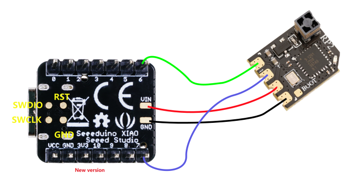

USB CRSF/ELRS Receiver
======================

Use your ELRS transmitter as a joystick for your PC simulator using a 
microcontroller and ELRS receiver.


## Hardware Requirements / Recommendations
 - Microcontroller:
   - [Seeed Studio XIAO SAMD21](https://www.seeedstudio.com/Seeeduino-XIAO-Arduino-Microcontroller-SAMD21-Cortex-M0+-p-4426.html)
   - [Seeed Studio XIAO RP2040](https://www.seeedstudio.com/XIAO-RP2040-v1-0-p-5026.html)
 - ELRS Receiver:
   - [Happymodel EP2](http://www.happymodel.cn/index.php/2021/04/10/happymodel-2-4g-expresslrs-elrs-nano-series-receiver-module-pp-rx-ep1-rx-ep2-rx)
   - [Radiomaster RP2](https://www.radiomasterrc.com/products/rp2-expresslrs-2-4ghz-nano-receiver)
   - [iFlight ELRS Receiver](https://shop.iflight-rc.com/iFlight-ELRS-Receiver-Pro1757)

Note: While the XIAO RP2040 is supported, I recommend the XIAO SAMD21, as 
RP2040 platform support will take up some 2.5GB of space, so will take a while 
to download. I also ran into an issue on Windows 11 where the firmware could 
not be uploaded until using [Zadig](https://zadig.akeo.ie/) to install the 
`libusb-win32` driver for the `RP2 Boot2 (Interface 1)`. There is no reason the 
official Raspberry Pi Pico could not be used if you have one handy, but for 
compactness the XIAO boards are best.

The choice of ELRS receiver is up to you. The recommended receivers are due to 
the compact nature of the build, as they fit neatly within the footprint of the 
XIAO boards. 


## Device Connections: 

```
  XIAO   ---   ELRS
  =================
  5V  <－－－＞ 5V
  GND <－－－＞ GND
  RX  <－－－＞ TX
  TX  <－－－＞ RX
```
Both signal lines are 3.3V, just connect them as they are. Since this is serial 
communications, it is necessary to connect RX of one side to the TX of the 
other, and vice versa.

### XIAO SAMD21


### XIAO RP2040


As you can see from the images, the XIAO boards have a VIN and GND pin at the 
bottom, which is actually 5V and GND when the USB is plugged in. So you all the 
connections are accessible from the end with these boards, making the resulting 
build very neat. 


## Finished builds

### XIAO SAMD21 /w  Happymodel EP2 Receiver
The antenna has seen better days!


### XIAO RP2040 /w  iFlight 2.4Ghz Receiver
This isn't as compact as some of the others, but has the added benefit of 
coming with pre-soldered wires on the receiver - just cut the plug off and 
solder the wires onto the microcontroller!


## Building and Uploading
You can either download a prebuilt binary from https://github.com/pfeerick/USB_ELRS_Receiver/releases/tag/latest, and install it to your device (for the RP2040/PICO targets it is a simple drag and drop / copy to firmware drive operation), or use the following notes as a guide on how to build the firmware locally, and upload it to your device.

I will assume you have already installed [VSCode](https://code.visualstudio.com/) and [PlatformIO](https://platformio.org/platformio-ide) via the respective installation guides. Once you have download the code from this repo to your computer (either via git clone or [downloading as a zip](https://github.com/pfeerick/USB_ELRS_Receiver/archive/refs/heads/master.zip)), open up the folder in VSCode. You will then be able to choose the PlatformIO "alien head" icon head in the sidebar, and then choose the build and upload task for your desired target. PlatformIO will automatically install the dpendences when you change targets, which may take some minutes to download. 

For example, to build and upload to the XAIO SAMD21 in one step:


## Acknowledgments:

Based on the project originally developed by kobatan:
- https://qiita.com/kobatan/items/40728fbb625057d9f42b
- https://qiita.com/kobatan/items/253f1614a8653a1dcb1a
